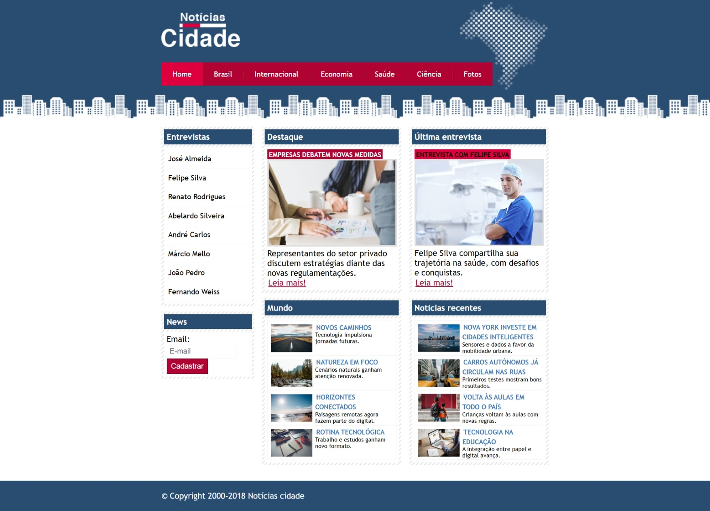

# 📰 Projeto Site de Notícias

Este é um projeto desenvolvido com **HTML** e **CSS**, criado com o objetivo de praticar e consolidar os fundamentos das duas tecnologias. O site simula a estrutura de um portal de notícias e conta com diferentes modelos de layout.

  

## 💡 Objetivos

- Praticar estruturação semântica com HTML  
- Utilizar CSS para estilização e organização visual  
- Trabalhar com múltiplas variações de layout  
- Reforçar o uso de formulários, listas e navegação

## 🧱 Funcionalidades e recursos

- 🔹 Barra de navegação **horizontal e vertical**
- 🔹 Uso de **formulários** e **listas**
- 🔹 **Três tipos de layout**

## ✒️ Autor

* **Kevin Nakashima** - [Dev](https://github.com/Kryonn).

###### Udemy
